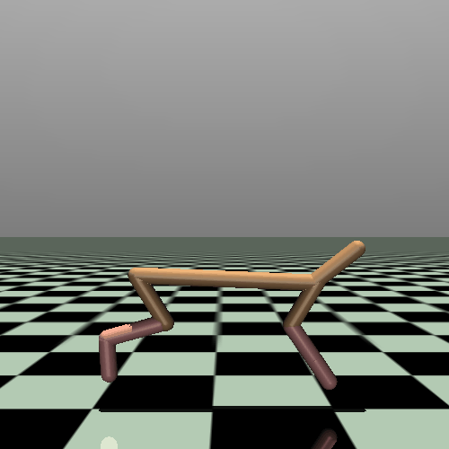
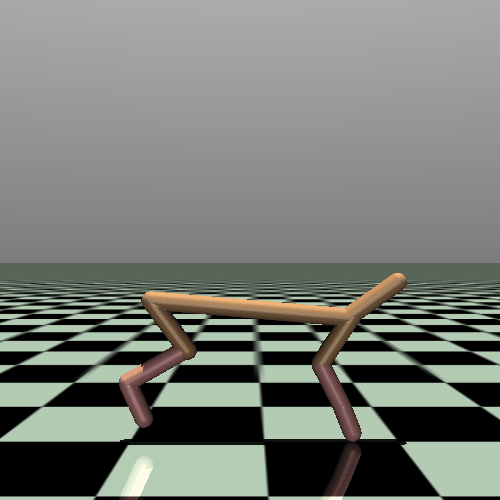
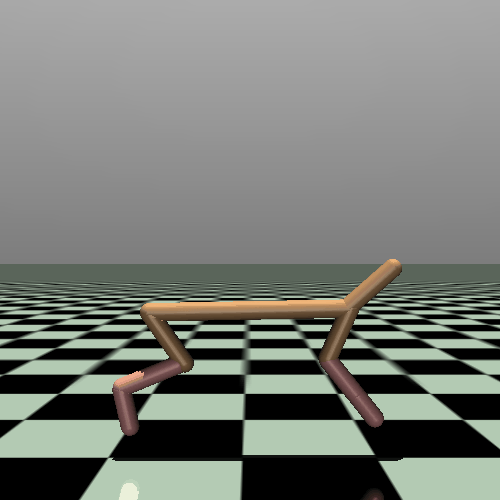
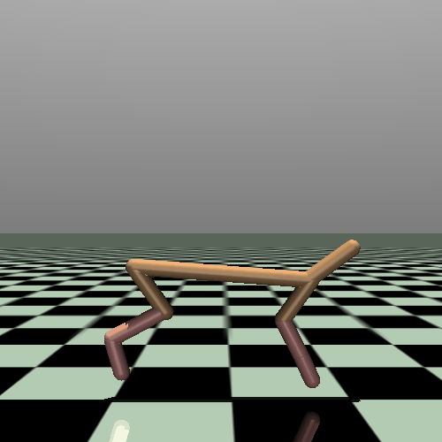
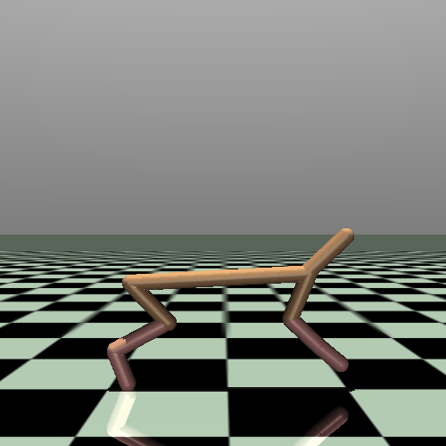
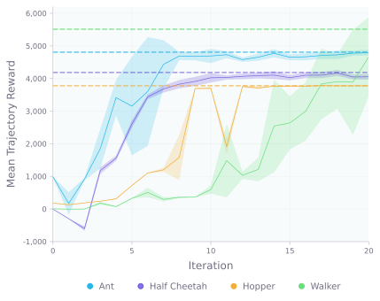

# imitation-learning

This repository applies the DAgger algorithm ([Ross et al., 2010](https://arxiv.org/abs/1011.0686)) to several environments from the MuJoCo Gym task suite. Most existing implementations use convoluted approaches that obfuscate key ideas; as such, this codebase seeks to remain faithful to the algorithm's original formulation while emphasizing conciseness and simplicity.

<table align="center">
  <tr>
    <td></td>
    <td></td>
    <td></td>
    <td></td>
    <td></td>
   </tr> 
   <tr>
      <td align="center"><em>&nbsp&nbspExpert&nbsp&nbsp</em></td>
      <td align="center"><em>Iteration 1</em></td>
      <td align="center"><em>Iteration 5</em></td>
      <td align="center"><em>Iteration 10</em></td>
      <td align="center"><em>Iteration 20</em></td>
  </td>
  </tr>
</table>

## Details
DAgger is an iterative method for imitation learning. It leverages corrective actions from an expert to mitigate the compounding errors that arise from the distribution mismatch between the expert and agent:

  

Implementation details, as well as brief explanations of the relevant hyperparameters, are as follows:
- Line 2: the agent is initialized as a two-layer MLP with `hidden_dim` units in the hidden layer.
- Line 3: a total of `n_iter` DAgger iterations are performed.
- Line 4: the 𝜷 ᵢ coefficients are set to zero.
- Line 5: a single trajectory of at most `max_traj_len` timesteps is sampled.
- Line 8: the agent is trained by sampling a batch of `train_batch_size` timesteps from the aggregated dataset and backpropagating the MSE loss between the expert's actions and the corresponding actions prescribed by the agent. Training uses an Adam optimizer with a learning rate of `lr` and proceeds for `n_batch_updates_per_iter` optimization steps.
- Line 10: `eval_batch_size` trajectories are sampled for evaluation, and the average total reward per trajectory is used as a metric to determine performance.

## Experiment

The algorithm is evaluated on the Ant-v2, HalfCheetah-v2, Hopper-v2, Walker2d-v2, and Humanoid-v2 environments using the same hyperparameter values for each run. The figure below shows the reward over 20 iterations, with expert data shown in dashed lines. Results from the Humanoid-v2 trial are omitted since the reward was consistently below 250; this is most likely because the Humanoid-v2 environment has a much larger action space (376-dimensional) than the others.

  

The videos in the introduction section show expert and agent half cheetahs over several iterations to qualitatively demonstrate the agent's ability to imitate the expert's behavior.

## References

- This repository follows the DAgger algorithm developed in [A Reduction of Imitation Learning and Structured Prediction to No-Regret Online Learning (Ross et al., 2010)](https://arxiv.org/abs/1011.0686).
- The expert policy is adapted from [berkeleydeeprlcourse/homework_fall2021](https://github.com/berkeleydeeprlcourse/homework_fall2021), which contains an incomplete implementation of DAgger.
